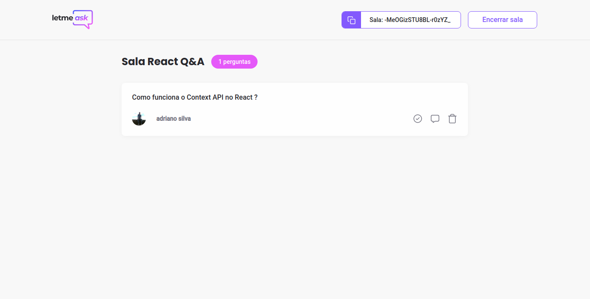
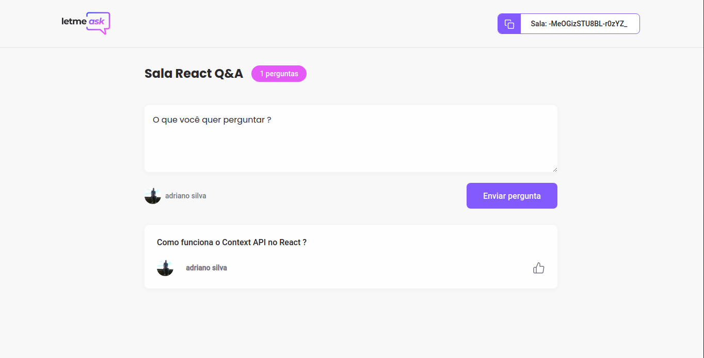

<h1 align="center">
   
</h1>

# Letmeask

# Screens





## Technologies used
  - [ReactJS](https://pt-br.reactjs.org)
  - [Typescript](https://www.typescriptlang.org)
  - [Styled Components](https://www.styled-components.com)
  - [Firebase](https://firebase.google.com)

## Requirements

You need to install both [Node.js](https://nodejs.org) and [Yarn](https://yarnpkg.com) or npm to run this project.

## How to use it

```bash
  # Install the dependencies
  $ yarn install
  # Run the web server
  $ yarn start
```

The app will be available for access on your browser at (http://localhost:3000)
